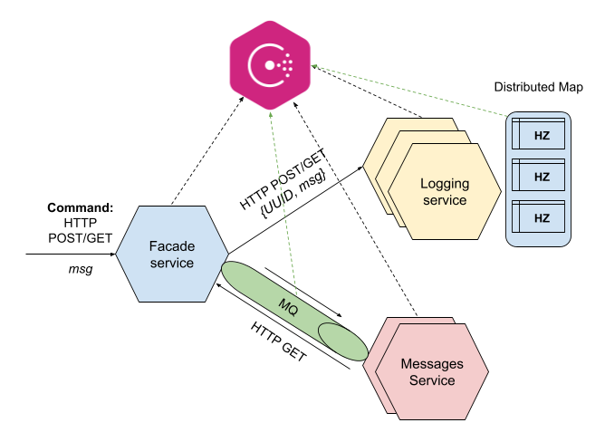

# UCU_Software_Architecture_Labs

## Implemented Labs

✅ **Lab 1:** Microservices Basics

✅ **Lab 2:** Hazelcast Basics

✅ **Lab 3:** Microservices with Hazelcast

✅ **Lab 4:** Microservices with Messaging queue

✅ **Lab 5:** Microservices using Service Discovery and Config Server based on Consul


## Project architecture




## Configurations

```shell
# Start Consul in dev mode. To access it go to http://localhost:8500
consul agent -dev

# Add configs for Kafka and Hazelcast to Key-Value storage in Consul
UCU_Software_Architecture_Labs $ bash consul_registr_init_configs.sh

# Start 3 nodes of Hazelcast
hz start

# Start Hazelcast management center. To access it go to http://localhost:8080
hz-mc start

# Download kafka zip locally from https://kafka.apache.org/downloads
# and enter its bin directory

# Start zookeeper server
zookeeper-server-start.sh config/zookeeper.properties

# Start kafka bootstrap server
kafka-server-start.sh config/server.properties

# Create Kafka topics
kafka-topics --zookeeper 127.0.0.1:2181  --topic MessageSvcTopic --create --partitions 3 --replication-factor 1

# Example how to read messages from topics with Kafka consumer CLI
kafka-console-consumer --bootstrap-server 127.0.0.1:9092 --topic MessageSvcTopic --from-beginning
```


## How to run the project

```shell
# Firstly, enter virtual envs in each terminal to run the next microservices

# Start facade-service with UI in PyCharm or with the next command
UCU_Software_Architecture_Labs/facade-service $ bash start_service.sh 8081

# Start 2 instances of messages-service with the next commands
UCU_Software_Architecture_Labs/messages-service $ bash start_service.sh 8083
UCU_Software_Architecture_Labs/messages-service $ bash start_service.sh 8084

# Start 3 instances of logging-service with the next commands
UCU_Software_Architecture_Labs/logging-service $ bash start_service.sh 8091
UCU_Software_Architecture_Labs/logging-service $ bash start_service.sh 8092
UCU_Software_Architecture_Labs/logging-service $ bash start_service.sh 8093
```
